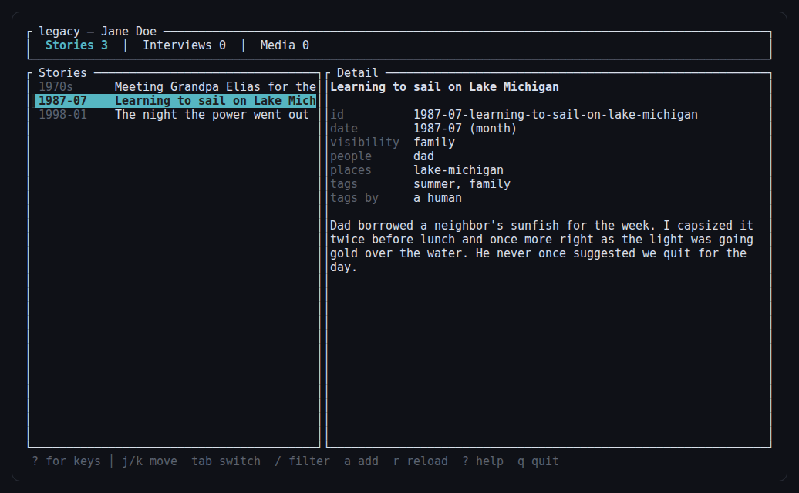
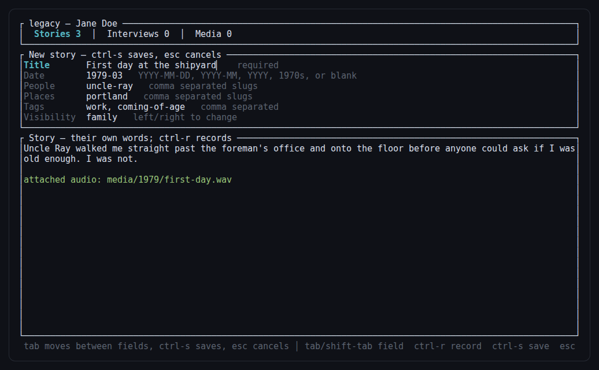

# legacy

A local-first, self-hosted life-story vault. One person runs this on their own
machine over months or years to record their life story as plain Markdown and
media files, then seals the result so a threshold of trusted keyholders can
unlock it after their death. The unlocked archive can be read as plain files,
or loaded by an LLM to answer questions in the subject's own voice.

See [Archive format](#archive-format) for the on-disk layout, [Status](#status)
for what works today, and [To do](#to-do) for what does not yet.

## Non-negotiable design principles

1. **Plain files on disk are the source of truth.** Markdown with YAML
   frontmatter for stories, original binaries for media. SQLite is only ever
   a rebuildable search index — delete it and `legacy timeline build` brings
   it back.
2. **No cryptography is implemented here.** Encryption is done by shelling
   out to [`age`](https://age-encryption.org); key splitting is done by the
   `sssmc39` SLIP-0039 crate. This program contributes no primitive of its
   own — only the Bech32 text encoding that turns an age identity into the
   32 bytes the splitter takes, which is a data format, not a cipher.
3. **No lock-in.** No custom container format, no language-specific
   serialization, no vendor-specific codecs. Sealed bundles are an ordinary
   `tar` inside an ordinary `age` file.
4. **Offline by default.** All LLM and speech features are opt-in per
   invocation. Recording, organizing, sealing, and unsealing the archive
   require no network access at all.
5. **The archive explains itself.** Every archive root has an unencrypted
   `README.txt` describing the layout, formats, encryption scheme, and the
   exact commands needed to reconstruct the key and decrypt — written for a
   reader in 30 years who has never heard of this tool.

## Installing

```bash
cargo install --path .
```

The project pins Rust 1.97.1 via `rust-toolchain.toml`. Requires `age` and
`age-keygen` on `PATH` for anything encryption-related, `par2` for
recovery-data generation on sealed archives, and `ffprobe`/`ffmpeg` for
media metadata and voice recording. All of them are optional: the program
degrades to doing less rather than failing, and tells you which tool is
missing when a command actually needs one.

### Built with strictrs

This is a [strictrs](https://github.com/ilvar/strictrs) project — a strict
subset of Rust with a machine-readable diagnostic loop. In practice that
means no `unsafe`, no `unwrap`/`expect`/slice indexing outside tests, no
numeric `as` casts, no glob imports, no mutable globals, and every
filesystem, process, and network effect confined to a module marked
`// strictrs: capability`.

That last rule shaped the architecture: [`src/cap.rs`](src/cap.rs) is the
only file in the crate that names `std::fs`, `std::process`, or `std::net`.
Everything else goes through it, so the program's entire blast radius —
every file it can touch, every binary it can run, every host it can reach —
is auditable by reading one file.

```bash
strictrs check .     # deterministic JSON diagnostics; must be clean
cargo test           # unit and integration tests
cargo fmt --check
```

## Quick start

```bash
legacy init ./my-archive --subject "Jane Doe" --threshold 3 --shares 5
legacy story add --archive ./my-archive --title "Starting university" --date 1994-09-15 \
    --tags education,leaving-home --body "I packed one suitcase and took the train."
legacy story list --archive ./my-archive

# Regenerate timeline.md, the search index, MANIFEST.sha256, and README.txt
# after adding stories or editing archive.yaml:
legacy timeline build --archive ./my-archive

# Check the archive against MANIFEST.sha256 (and par2 recovery data once sealed):
legacy verify --archive ./my-archive

# Encrypt the family and executor-only tiers; prints shares to the terminal ONLY:
legacy seal --archive ./my-archive

# Reconstruct a key from enough shares and decrypt the matching tier:
legacy unseal --archive ./my-archive --share "..." --share "..."
```

## Terminal browser

```bash
legacy tui --archive ./my-archive
```

A full-screen view for browsing stories, interviews, and media, and for
adding new stories without leaving the terminal. `j`/`k` or the arrow keys
move, `tab` switches between the three lists, `/` filters, and `a` opens
the add-story form. Voice mode records with `ctrl-r`: the take is
ingested into `media/` and archived *before* transcription is attempted,
so a failed or unconfigured transcription never loses the recording.

<p>
  
  
</p>

(Sample data shown above — a demo archive, not a real one.)

## Archive format

```
my-archive/
  README.txt                  # unencrypted, always. Explains everything below.
  verify-archive.sh           # plain-bash integrity check, no `legacy` install required
  archive.yaml                # subject name, schema version, per-tier encryption config
  MANIFEST.sha256              # sha256sum-compatible checksum list
  timeline.md                  # generated chronological index (legacy timeline build)
  timeline/
    1978/
      1978-03-anecdote-first-bicycle.md
    1994/
      1994-09-15-started-university.md
    undated/
      dad-and-the-fishing-trip.md
  people/
    mary-oconnor.md
  places/
    celbridge.md
  media/
    1994/
      1994-09-15-graduation-001.jpg
      1994-09-15-graduation-001.jpg.yaml   # sidecar metadata
  interviews/
    2026-08-14-childhood-session-01.md
    2026-08-14-childhood-session-01.wav
  sealed/
    family.tar.age               # created by `legacy seal`
    family.tar.age.par2
    executor-only.tar.age
    executor-only.tar.age.par2
```

### Story file format

```markdown
---
id: 1994-09-15-started-university
title: Starting university
date: '1994-09-15'
date_precision: day
people:
- mary-oconnor
places:
- dublin
tags:
- education
- leaving-home
media: []
source: interview:2026-08-14-childhood-session-01
recorded_at: '2026-08-14T19:22:31Z'
tags_generated_by: null
visibility: family
---

Free prose. This is the story as the subject told it, lightly cleaned up at most.
```

`date` may be `YYYY-MM-DD`, `YYYY-MM`, `YYYY`, or `YYYYs` for a decade;
`date_precision` is `day | month | year | decade | unknown`.
`tags_generated_by` is null for a human and the model id otherwise — never
blurred. `visibility` is `public | family | executor-only`.

Frontmatter is written by an explicit emitter rather than a generic
serializer, because the exact bytes are part of the archive's contract.
Field order is fixed so files diff cleanly, and any scalar that a YAML
reader could coerce is quoted — an unquoted `1994-09-15` is a timestamp to
some readers and a string to others, which a thirty-year archive cannot
afford. Reading uses a real YAML parser, so hand-edited files still load.

Rules the code enforces:
- Fuzzy dates are first-class: a story's date may be known only to the year,
  month, or decade, or not at all. The program never invents precision.
- The `id` is derived once from the date prefix (if any) and a slug of the
  title, and used as the filename; it also determines which `timeline/<year>/`
  bucket (or `timeline/undated/`) the file lives in.
- LLM-generated tags are written to frontmatter but always flagged via
  `tags_generated_by`; the human's own words in the body are never rewritten
  by a model.
- `visibility` gates which encrypted tier (if any) a story ends up in when
  the archive is sealed, and what the replica is allowed to discuss.

### Interview subsystem

Question banks are plain YAML, compiled into the binary from
`src/templates/interviews/*.yaml`. A file of the same name in a directory
passed as `--bank-dir` overrides the built-in one, so the shipped questions
can be edited without rebuilding:

```yaml
name: childhood
description: Early years, family, home
questions:
  - id: earliest-memory
    prompt: What is the earliest thing you can remember?
    followups:
      - How old were you?
      - Who else was there?
    tags: [childhood, memory]
```

Ships ten banks: `childhood`, `family-and-origins`, `school`, `work`,
`love-and-partnership`, `parenthood`, `beliefs-and-values`, `turning-points`,
`advice-and-messages`, `objects-and-places`.

```bash
legacy interview start childhood --archive ./my-archive
legacy interview resume 2026-08-14-childhood-session-01 --archive ./my-archive
```

Each answer is written as a story file (`timeline/<year>/<session-id>-<question-id>.md`,
`source: interview:<session-id>`) **immediately** after you finish typing it —
before the session state file is updated — so a crash mid-session never loses
an already-given answer. During a session: finish an answer with a line
containing just `END`, type `SKIP` alone to move on without answering, or
`QUIT` to stop and resume later. The session itself is recorded at
`interviews/<session-id>.md`: which questions are answered/skipped, which
story each became, and a running transcript. `--voice` mode (record audio,
transcribe with Whisper, keep both) lands in step 7 — the question bank and
resumability work fully offline without it.

### Media sidecar format

Every file under `media/` has a same-named `.yaml` sidecar recording what the
program knows about it -- the original is never modified or transcoded:

```yaml
original_filename: IMG_0001.JPG
ingested_at: '2026-08-14T16:40:10Z'
sha256: 53d5e412...
size_bytes: 6699
mime_type: image/jpeg
date: '1994-09-15'
date_precision: day
date_source: manual        # exif | filesystem | manual | unknown
width: 3000
height: 2000
duration_seconds: null
visibility: family
caption: null               # free text, edit by hand
```

`legacy media ingest <dir> [--date-from-exif] [--date YYYY[-MM[-DD]]] [--visibility ...]`
copies every recognized media file from `<dir>` into `media/<year>/`, named
`<date>-<slug-of-original-name>-NNN.<ext>` (or `media/undated/...` if no date
is known), and writes its sidecar. `--date-from-exif` best-effort reads a
capture date via `ffprobe`; without it (or if nothing is found), the date is
left `unknown` until you either pass `--date` or hand-edit the sidecar YAML.

### archive.yaml

```yaml
schema_version: 1
subject:
  name: Jane Doe
created_at: 2026-08-14T00:00:00Z
tiers:
  family:
    threshold: 3
    shares: 5
    identity_sha256: null       # filled in by `legacy seal`
    plaintext_escrow: false
  executor-only:
    threshold: 3
    shares: 5
    identity_sha256: null
    plaintext_escrow: false
keyholders: []
replica:
  sunset: null
```

`legacy init` seeds both tiers with the same threshold/shares given on the
command line; edit `archive.yaml` by hand before sealing if you want, e.g.,
a looser 2-of-4 for `family` and a stricter 3-of-5 for `executor-only` — it
is plain YAML, no command required to change it.

### Encryption design

Stories marked `visibility: public` are never encrypted — they stay as
plain files in `timeline/` permanently, since they're intended to be
shared with anyone. `legacy seal` builds one encrypted tier bundle each for
`family` and `executor-only`: a fresh `age` identity is generated per tier,
used to encrypt that tier's files into `sealed/<tier>.tar.age`, split into
SLIP-0039 mnemonic shares at the tier's configured threshold, printed once
to the terminal, and then discarded — the archive never stores the key
itself, only the SHA-256 of it (to verify a reconstructed key before
concluding the archive is corrupt). `par2` recovery data is generated
alongside each sealed blob. A `--plaintext-escrow` flag is available per
seal run for cases where losing the family's access is a bigger risk than
the confidentiality it buys.

`legacy seal` never touches or deletes the plaintext archive — it is purely
additive. Your working copy stays exactly as it was; `sealed/<tier>.tar.age`
is a distributable snapshot for keyholders. `people/`, `places/`, and
`interviews/` (session transcripts and audio) are bundled into the
**family** tier only, not duplicated into `executor-only` — they're shared
reference material and raw interview sessions, which default to
family-level sensitivity.

`legacy unseal --share "..." --share "..."` reconstructs the identity from
however many shares you give it, matches its SHA-256 against `archive.yaml`
to figure out which tier it belongs to (no need to specify), and decrypts
that tier into `<archive>/unsealed/<tier>/`.

## LLM tagging, voice mode, and the replica

All three are optional, opt-in per invocation, and require network access
and credentials -- everything else in this program (recording, organizing,
sealing, decrypting) works with zero network access. They live in
`src/core/llm.rs` and `src/core/voice.rs`, which nothing else in the
program imports; the replica in particular is a *reader* of the archive,
not a component of it, and can be deleted entirely without losing anything
else.

**Tagging and the replica** (`src/core/llm.rs`) talk to any
OpenAI-compatible endpoint, so a local model server works too:

```bash
export OPENAI_API_KEY=sk-...          # already exported? nothing else needed

legacy tag --archive ./my-archive                # preview suggested tags (default)
legacy tag --archive ./my-archive --apply         # write them; sets tags_generated_by

legacy ask "What did you do after school?" --archive ./my-archive
```

### Configuration

Every optional feature reads a `LEGACY_`-prefixed variable first and falls
back to the conventional vendor name, so a shell that already exports
`OPENAI_API_KEY` needs no further setup, while anyone who wants this
program pointed at a different model can override it without disturbing
the rest of their environment. An empty value counts as unset.

| Setting | Checked in order | Default |
|---|---|---|
| LLM key | `LEGACY_LLM_API_KEY`, `OPENAI_API_KEY` | none (feature disabled) |
| LLM endpoint | `LEGACY_LLM_BASE_URL`, `OPENAI_BASE_URL` | `https://api.openai.com/v1` |
| LLM model | `LEGACY_LLM_MODEL`, `OPENAI_MODEL` | `gpt-4o-mini` |
| Speech key | `LEGACY_OPENAI_API_KEY`, `OPENAI_API_KEY` | none (feature disabled) |
| Speech endpoint | `LEGACY_OPENAI_BASE_URL`, `OPENAI_BASE_URL` | `https://api.openai.com/v1` |
| Transcription model | `LEGACY_STT_MODEL` | `whisper-1` |
| Speech model / voice | `LEGACY_TTS_MODEL`, `LEGACY_TTS_VOICE` | `tts-1`, `alloy` |
| Microphone input | `LEGACY_FFMPEG_AUDIO_INPUT` | `alsa:default` |

`ask` retrieves candidate stories with the SQLite FTS index (`timeline build`
must have run at least once), builds a keyword-OR query from the question
so a full sentence still finds matches, then asks the model to answer using
*only* those stories, quoting the subject's own words where possible.
Unsupported questions get refused ("they never talked about that with me")
rather than answered from the model's imagination. Every answer that isn't
a refusal cites the story ids it drew on. The replica can never surface
`executor-only` material — that restriction is hard-coded, not a flag — and
`archive.yaml`'s `replica.sunset` date, if set, makes `ask` refuse to run
at all once passed.

**Voice mode** (`src/core/voice.rs`) uses Whisper for speech-to-text and
TTS for playback:

```bash
export OPENAI_API_KEY=sk-...
legacy interview start childhood --archive ./my-archive --voice
```

Recording shells out to `ffmpeg` against the system microphone (push a key
to start, again to stop); the WAV is saved as
`interviews/<session-id>-<question-id>.wav` — one file per question rather
than per session, so a session can be paused and resumed across multiple
sittings without needing to append to an in-progress recording — and is
never discarded after transcription. `--suggest-followups` (works in text
or voice mode) asks the model for one optional follow-up question after
each answer, clearly marked as a suggestion; the question bank drives the
interview either way and works fully without it.

## REST API

`legacy serve` runs a FastAPI app that mirrors the CLI 1:1 (JSON in, JSON
out), bound to `127.0.0.1` by default. There is no authentication in v1 —
it's meant for a single local user (e.g. a future GUI) driving the same
machine, not a multi-tenant service. If you expose it beyond localhost,
put a reverse proxy with auth in front yourself. There's no server-side
session state beyond the interview session id, which is just the filename
of an already-persisted session file.

```bash
legacy serve --port 8000

curl -X POST localhost:8000/stories -H 'content-type: application/json' -d '{
  "archive": "./my-archive", "title": "Starting university", "date": "1994-09-15"
}'
curl "localhost:8000/stories?archive=./my-archive&year=1994"
```

Routes: `POST /init`, `POST /stories`, `GET /stories`, `POST /timeline/build`,
`GET /verify`, `POST /media/ingest`, `POST /interviews`,
`GET /interviews/{id}`, `POST /interviews/{id}/answer`,
`POST /interviews/{id}/skip`, `POST /seal`, `POST /unseal`, `POST /tag`,
`POST /ask`. `POST /seal`'s response body contains the shares — same
"printed once, never stored" rule as the CLI, just delivered over HTTP
instead of the terminal. `/tag` and `/ask` need `LEGACY_LLM_API_KEY` set,
same as their CLI counterparts; voice mode has no HTTP route since it needs
a local microphone.

## Layout

```
src/
  main.rs          thin binary: parse argv, run the CLI, exit
  lib.rs
  args.rs          the small argument parser
  cap.rs           THE capability boundary: all fs, process, and network
  cli.rs           every command
  api.rs           the same commands over HTTP
  core/
    clock.rs       UTC timestamps
    crypto.rs      age + SLIP-0039 wrappers
    dates.rs       fuzzy dates
    index.rs       rebuildable SQLite FTS index
    interview.rs   question banks and resumable sessions
    llm.rs         optional tagging and the replica
    manifest.rs    MANIFEST.sha256
    media.rs       ingest and sidecars
    readme.rs      the archive's self-describing README.txt
    seal.rs        tiered encryption
    story.rs       the story file format
    timeline.rs    timeline.md and derived-state rebuild
    vault.rs       archive.yaml, open/create
    voice.rs       optional speech to text and back
    yaml.rs        the archive's YAML dialect
  templates/       question banks and verify-archive.sh, embedded at build
```

## Status

Everything described above is implemented and tested: archive format,
`init`, `story add`/`list`, `timeline build`, `verify`, `media ingest`, the
interview subsystem, `seal`/`unseal`, the REST API, and the optional LLM,
voice, and replica features. `strictrs check` is clean and CI builds
binaries for Linux, macOS, and Windows.

The end-to-end acceptance test for the "readable in 30 years" claim has
been run: seal an archive, then recover it on a machine with no `legacy`
binary using only the generated `README.txt` — a SLIP-0039 implementation
to combine the shares, any Bech32 implementation to rebuild the identity,
`sha256sum` to confirm it against the hash in `README.txt`, then `age -d`
and `tar -xf`. Stories come back as plain Markdown.

## To do

Roughly in the order they would pay off. Nothing here is required for the
archive to be complete and recoverable today; that already works.

**Correctness and durability**

- [ ] `legacy verify --repair` to invoke `par2 repair` when a sealed blob
      fails its check, instead of printing the command for the operator to
      run by hand.
- [ ] Detect a sealed tier that has drifted out of date — stories changed
      since the last `seal` — and say so in `verify`. Right now a stale
      bundle is silently stale.
- [ ] Verify sidecar checksums against their media during `verify`.
      `scripts/refresh-media.sh` does this today but nothing calls it.
- [ ] Round-trip property tests over the frontmatter emitter and parser:
      any story that renders must re-parse identically. The emitter is the
      one place where a quoting bug would corrupt an archive silently.

**Usability**

- [ ] `legacy story edit` and `legacy story rm`. Editing means opening the
      file by hand today, which is fine but undiscoverable.
- [ ] `people/` and `places/` are created and sealed but nothing writes
      them. A `legacy person add` would close the loop, and story
      frontmatter already references them.
- [ ] `legacy search <query>` exposing the FTS index directly, without
      going through the replica or needing a model.
- [ ] Media captions: the sidecar has a `caption` field that only a text
      editor can currently fill in.
- [ ] Shell completions, and a `--json` output mode so the CLI is as
      scriptable as the REST API.

**Keyholders**

- [ ] `archive.yaml` has a `keyholders` list that nothing reads. It should
      record who holds which share number, so an executor knows whom to
      call — without storing anything that weakens the threshold.
- [ ] A rehearsal command that checks a set of shares reconstructs the
      right key *without* decrypting anything, so keyholders can practise
      while the subject is alive to fix problems.

**Larger, less certain**

- [ ] Key rotation: re-seal with a fresh identity and reissue shares when
      a keyholder is lost or replaced.
- [ ] Embeddings-based retrieval as an option alongside FTS. FTS was the
      right default because it is debuggable and needs no model; it is
      weak on paraphrase.
- [ ] Incremental sealing for archives large enough that re-tarring
      everything is slow.
